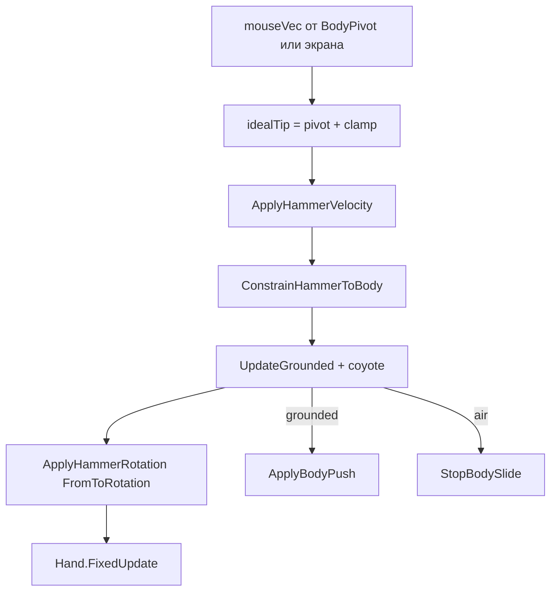

# PlayerBlackOut — аудит 2D (EnvScripts)

**Дата:** 2026-05-20  
**Сцена:** `Assets/_Scenes/TestEnv/Test.unity`  
**Код:** `Assets/_Scenes/TestEnv/EnvScripts/`  
**Unity:** 2022.3.62f3  

---

## 1. Краткий вывод

| Область | Статус | Комментарий |
|--------|--------|-------------|
| Архитектура | ✅ | Dynamic RB2D, velocity, без MovePosition |
| Поворот | ✅ | `FromToRotation(right, aim)` + фикс. `localScale` |
| Привязка к телу | ✅ | `BodyPivot`, `EffectiveMaxRange`, `ConstrainHammerToBody` |
| Hammer / Body | ✅ | `detachHammerAtStart` — молот под Player, не под Body |
| Мышь | ✅ | `mouseFromBodyPivot` — орбита от pivot, не от экрана |
| Grounded | ✅ | `IsTouchingLayers` + **coyote** (`coyoteFrames`) |
| Push / тюнинг | ✅ | `maxBodySpeed` 8, `pushDeadzone` 0.08 |
| Руки | ✅ | `Hand` в **FixedUpdate** (после PlayerControl) |
| Камни | ❌ | `piatra*` — только MeshCollider 3D (не трогали) |

**Активный стек:** только `EnvScripts` (`PlayerControl`, `Hand`, `Head`, `CameraFollowObject`).  
**Editor:** `GOI → Convert PlayerBlackOut to 2D`, `GOI → Layout Hammer Visual`.

---

## 2. Иерархия (Play Mode)

```
Player                          PlayerControl
├── Body                        RB2D Dynamic
│   ├── BodyPivot               центр орбиты / push
│   ├── Head / Hands            Hand → hammerHandle
│   └── …
└── HammerHead                  RB2D Dynamic (отвязан от Body)
    ├── UmbrellaHammerPivot
    └── UmrellaHammerHandler
```

**Ground:** layer 6, `BoxCollider2D` + Static RB2D.

---

## 3. Поток `FixedUpdate`



### Параметры (Test.unity)

| Параметр | Значение |
|----------|----------|
| maxRange | 1.02 (cap при maxRangeFromShaft) |
| maxRangeFromShaft | true |
| mouseFromBodyPivot | true |
| detachHammerAtStart | true |
| coyoteFrames | 2 |
| hammerMaxSpeed | 18.8 |
| maxBodySpeed | 8 |
| pushDeadzone | 0.08 |

---

## 4. Start не ломает сцену

В `Start` **нет**: layout меша, auto ResolveRefs, перезаписи RB.  
Только: кэш, `IgnoreCollision`, опционально `DetachHammerFromBody`.

---

## 5. Открытые задачи

1. **P0:** Collider2D на камни (`piatra*`).  
2. **P2:** Проверить offset collider vs `hammerHandle` для Hand.

---

## 6. Play Mode checklist

- [ ] Молот не jitter при движении Body  
- [ ] Орбита от BodyPivot следует за телом  
- [ ] Push не обрывается мгновенно при кратком отрыве (coyote)  
- [ ] Руки не «плывут» относительно молота  
- [ ] Scale HammerHead не меняется в Play  
